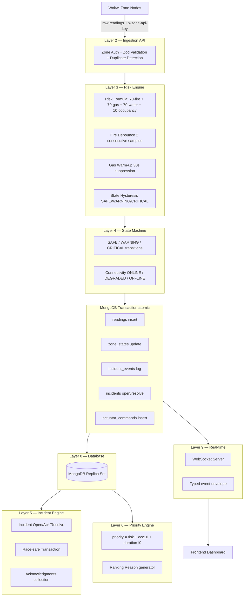

# SCS-RG Architecture

## System Layers



## Single Source of Truth

| Source of Truth | Authority |
|---|---|
| MongoDB `zone_states` | Current zone safety/connectivity state |
| MongoDB `incidents` | Active incident lifecycle |
| MongoDB `actuator_commands` | Latest actuator command per zone |
| Next.js Risk Engine | Risk score calculation (server-side only) |

Frontend **never** calculates risk, state, or priority. WebSocket events carry backend-computed state.

## Risk Formula (PDF Section 14)

```
risk_score = min(100,
  70 × fire_factor      ← 0 or 1 (requires fire debounce)
  + 70 × gas_factor     ← 0.0–1.0 (normalized ADC, 0 during warm-up)
  + 70 × water_factor   ← 0.0–1.0 (normalized ADC)
  + 10 × occupancy_factor  ← 0 or 1 (PIR or camera cross-check)
)
```

Thresholds: **SAFE** < 30 · **WARNING** 30–64 · **CRITICAL** ≥ 65

## State Hysteresis (PDF Section 15)

| Transition | Trigger |
|---|---|
| SAFE → WARNING | risk ≥ 30 AND ≥ 2 consecutive readings |
| WARNING → CRITICAL | risk ≥ 65 AND ≥ 2 consecutive readings |
| SAFE/WARNING → CRITICAL (immediate) | Fire debounce just completed |
| CRITICAL → WARNING | risk < 55 AND ≥ 5s stable |
| WARNING → SAFE | risk < 25 AND ≥ 5s stable |

## Priority Score (PDF Section 18)

```
priority_score = risk_score + occupancy_bonus(10) + duration_bonus(min 10, seconds/30)
```

Tie-breaking order: priority_score → risk_score → occupied → critical_since → zone_code (alphabetical)

## Key Design Decisions

1. **No in-memory state** — zone_states collection is authoritative; restart-safe.
2. **MongoDB Transactions** — ingestion atomically writes reading + zone_state + incident + command.
3. **Unique partial index** `{zoneId, active: true}` enforces one active incident per zone at DB level.
4. **Duplicate detection** by `(zoneId, bootId, sequence)` unique index — idempotent retries.
5. **WebSocket event envelope** — all events include `event_id`, `event_type`, `occurred_at`, `version`.
6. **AI/ML advisory only** — Gemini/OpenRouter/ML prediction cannot issue actuator commands.
