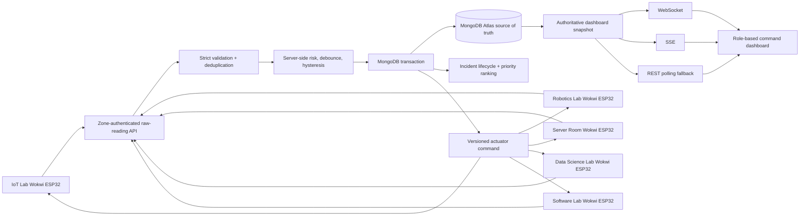

# SCS-RG System Architecture

## End-to-end data path



## Responsibility boundaries

| Layer | Responsibility |
|---|---|
| ESP32/Wokwi | Sample raw values, debounce PIR, report sensor health, cache/replay on network loss, apply only newer commands |
| API/backend | Authenticate, validate, deduplicate, compute risk/state, create incidents, rank priorities, enforce RBAC/CSRF |
| MongoDB Atlas | Durable zones, sensor history, incidents/events, acknowledgments, users/roles, commands, overrides and predictions |
| Dashboard | Live map, explicit Offline display, priority rationale, alert stack/audio, history/timeline, role-specific actions |

## Risk fusion

```text
risk_score = min(100,
  70 × fire_confirmed
  + 70 × gas_factor
  + 70 × water_factor
  + 10 × occupancy_factor
)

risk < 30       → SAFE
30 ≤ risk < 65  → WARNING
risk ≥ 65       → CRITICAL
```

The cap keeps the operator scale at 0–100. Each genuine hazard can independently reach Critical. Occupancy is a human-exposure modifier and has an additional priority-ranking contribution.

### Sensor processing

- **Fire:** 500 ms sampling; two consecutive positive readings ≈ one second; two clear readings remove confirmation, then recovery hysteresis applies.
- **Gas:** `clamp((raw - 1200) / (3000 - 1200), 0, 1)`; ignored for the first 30 seconds after device boot.
- **Water:** `clamp(level / 80, 0, 1)` for input range 0–100.
- **PIR:** approximately one-second entry and two-second exit stability; a disconnected PIR is Offline, never silently empty.

## Safety versus connectivity

Safety (`SAFE/WARNING/CRITICAL`) and connectivity (`ONLINE/DEGRADED/OFFLINE/NOT_CONFIGURED`) are separate fields. When required sensors or transport fail, the backend preserves the last known risk, occupancy, active incident and safety command. The dashboard shows `OFFLINE/UNAVAILABLE` while explicitly retaining the last known safety state.

Backend liveness uses **server receipt time**, not the device clock. This prevents stale NTP or replayed observation timestamps from falsely making a live node Offline. Replayed samples captured before NTP synchronization are stored as late evidence and cannot mutate current state or actuators. Default Offline timeout: 20 seconds.

## State and incident hysteresis

```text
SAFE → WARNING: risk ≥ 30 for two valid readings
SAFE/WARNING → CRITICAL: risk ≥ 65 for two valid readings
Confirmed fire: CRITICAL immediately after the fire debounce
CRITICAL → WARNING: risk < 55 continuously for at least five seconds
WARNING → SAFE: risk < 25 continuously for at least five seconds
```

One incident remains active through a Critical → Warning recovery and closes only at confirmed Safe. A later new trigger creates a new incident.

## Priority ranking

```text
priority_score = current risk
               + 10 when occupied
               + min(10, critical_duration_seconds / 30)
               + validated matching NLP bonus (0, 3 or 7)
```

Tie-breaks: priority score, risk, occupied first, earliest Critical time, then zone code. The API returns `ranking_reason`; the frontend displays this exact backend explanation rather than a hardcoded sentence.

## Real-time reliability

- WebSocket sends a complete authoritative snapshot immediately after authentication.
- State/incident events trigger a debounced authoritative refresh.
- Browser reconnect uses exponential backoff.
- When WebSocket is unavailable, the dashboard polls `/api/v1/dashboard/snapshot` every two seconds; while connected it performs a 15-second consistency refresh.
- Wokwi posts at 2 Hz and polls commands every five seconds only as fallback; each POST response also contains the latest command.
- Offline queue holds about 60 seconds and replays at most three cached samples per live cycle to avoid reconnect bursts.

## Concurrency and safety

- Unique reading `(zoneId, bootId, sequence)` prevents duplicate retries.
- One active incident per zone and one acknowledgment per incident.
- Transactions atomically write reading/state/incident/event/command.
- Per-zone command version is allocated atomically, resolving sensor/override races.
- `SILENCE` cannot turn off a Critical relay; `RESET` cannot force a sensor-derived Critical state to Safe.

## Bonus separation

- Short-term trend uses recent live risk slope.
- ML prediction is a trained logistic-regression probability for the next two minutes, visibly separate from live risk and advisory-only.
- Natural-language reports must map to a configured zone/hazard/severity and pass deterministic validation before a bounded priority bonus can apply.
- None of these bonus outputs can directly actuate buzzer, relay or LEDs.
