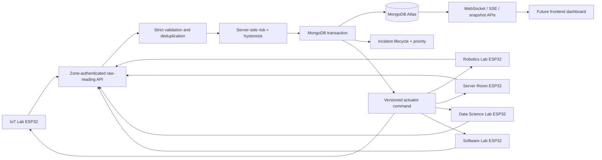

# SCS-RG Backend and Five-Zone Architecture

## Data path



The frontend is outside the current fix scope. The API and real-time gateway remain ready for it.

## Responsibilities

| Component | Responsibility |
|---|---|
| ESP32/Wokwi node | Sample raw sensors, debounce PIR locally, cache during network loss, replay data, apply versioned commands |
| Ingestion API | Authenticate zone, validate raw values, reject malformed/impossible input, deduplicate retries |
| Risk engine | Normalize raw signals, enforce gas warm-up and fire debounce, compute risk and state |
| MongoDB Atlas | Durable source of truth for zone state, readings, incidents, events, acknowledgments, commands and users |
| Incident engine | Open on confirmed Critical, keep active through Warning, resolve only after Safe |
| Priority engine | Rank currently Critical zones by risk, occupancy, duration and bounded validated NLP evidence |
| Command service | Atomically allocate per-zone versions and enforce safe override semantics |

## Risk fusion formula

The case permits teams to adapt the example weights when they explain them. This build uses:

```text
risk_score = min(100,
  70 × fire_confirmed
  + 70 × gas_factor
  + 70 × water_factor
  + 10 × occupancy_factor
)
```

Classification:

```text
risk < 30       SAFE
30 ≤ risk < 65  WARNING
risk ≥ 65       CRITICAL
```

Rationale:

- A confirmed fire must be capable of causing Critical by itself.
- Critical gas concentration must be capable of causing Critical by itself.
- Critical flood/leak level must be capable of causing Critical by itself.
- Occupancy is a human-exposure modifier, not a hazard that independently triggers cutoff.
- The score is capped at 100 for a stable operator-facing scale.
- Occupancy has an additional explicit role in cross-zone priority ranking.

## Sensor processing

### Fire

- Sample interval: 200 ms
- Confirmation: five consecutive positive samples, approximately one second
- Shorter flicker: ignored
- Clear: three consecutive clear samples
- State recovery then follows the five-second hysteresis window

### Gas

```text
gas_factor = clamp((gas_raw - 1200) / (3000 - 1200), 0, 1)
```

The first 30 seconds of device uptime produce zero gas contribution.

### Water

```text
water_factor = clamp(water_level / 80, 0, 1)
```

The accepted payload range is 0–100.

### Occupancy

- PIR entry must remain high for approximately one second.
- Exit must remain low for approximately two seconds.
- If PIR is offline, the backend preserves last known occupancy instead of assuming empty.
- `cameraOccupancy` is only a development cross-check switch; it is not an image-based camera bonus.

## Safety and connectivity are separate

`zone_states.safetyState` is one of `SAFE`, `WARNING`, `CRITICAL`.  
`zone_states.connectivityState` is one of `ONLINE`, `DEGRADED`, `OFFLINE`, `NOT_CONFIGURED`.

A sensor/network fault does not prove a hazard disappeared. Therefore an `OFFLINE` report preserves:

- last safety state
- last risk score and components
- last occupancy
- active incident
- critical relay state when already critical

## Hysteresis and incident lifecycle

```text
SAFE → WARNING: risk ≥ 30 for two consecutive valid readings
SAFE/WARNING → CRITICAL: risk ≥ 65 for two consecutive valid readings
Confirmed fire → CRITICAL immediately after the five-sample fire debounce
CRITICAL → WARNING: risk < 55 continuously for at least five seconds
WARNING → SAFE: risk < 25 continuously for at least five seconds
```

Incident lifecycle:

```text
Critical → create one active incident
Critical → Warning → incident remains active
Warning → Critical → same incident continues
Warning → Safe → incident resolves
Resolved hazard triggers later → a new incident is created
```

## Priority ranking

```text
priority_score = risk_score
               + (occupied ? 10 : 0)
               + min(10, critical_duration_seconds / 30)
               + bounded_matching_NLP_bonus
```

NLP bonus is `0`, `3` or `7` and applies only when the report is recent, validated, matches the active incident's zone and hazard, and the zone is currently Critical.

Tie-break order:

1. Higher priority score
2. Higher risk score
3. Occupied before empty
4. Earlier `criticalSince`
5. Alphabetical zone code

## Concurrency model

- Unique reading index: `(zoneId, bootId, sequence)`
- One active incident per zone: partial unique index
- One acknowledgment per incident: unique index
- One command version per zone: unique index
- Ingestion updates state using `stateVersion` optimistic concurrency
- Sensor ingestion and override writers allocate command versions with atomic `$inc`
- MongoDB transactions atomically write reading, state, incident/event and command changes

## Override safety

- `SILENCE` may turn off the buzzer but never a Critical relay cutoff.
- `RESET` cannot force a Critical zone to Safe.
- `TEST_ACTUATOR` is audited and versioned.
- The highest command version is applied once by firmware.

## Resilience

- Backend restart reloads all current zone and incident state from Atlas.
- Every reconnecting real-time client receives a full snapshot.
- Firmware caches up to 180 readings and replays them in sequence.
- Replayed old timestamps are stored as late data but cannot overwrite current state.
- `CACHED_READINGS_SYNCED` is logged on the final replayed sample.
