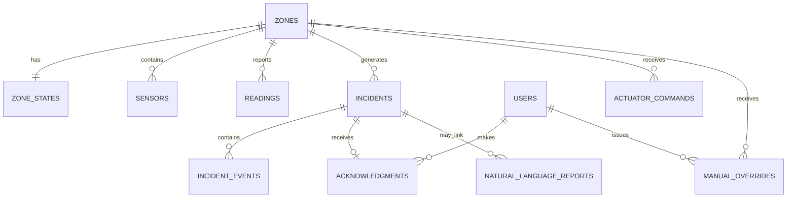

# MongoDB Atlas Schema — SCS-RG

MongoDB Atlas is the official database path. Transactions require an Atlas replica-set deployment, which Atlas provides.

## Collections

| Collection | Purpose | Key integrity/index rule |
|---|---|---|
| `zones` | Five official zone identities and fast current-state snapshot | `code` unique |
| `zone_states` | Authoritative durable live state | `zoneId` unique |
| `sensors` | Four calibrated required sensors per zone | `(zoneId, sensorType)` unique |
| `readings` | Raw + normalized/computed reading history | `(zoneId, bootId, sequence)` unique; 90-day TTL |
| `incidents` | Open/acknowledged/resolved lifecycle | one `active=true` incident per zone |
| `incident_events` | Ordered full timeline | `(incidentId, occurredAt)` |
| `acknowledgments` | First successful acknowledgment | `incidentId` unique |
| `actuator_commands` | Durable versioned node commands | `(zoneId, commandVersion)` unique |
| `manual_overrides` | Audited Admin actions | `(zoneId, active)` |
| `users` | Admin and Security Staff accounts/roles | `email` unique |
| `sessions` | HttpOnly login sessions + CSRF token | `expiresAt` TTL |
| `predictions` | Advisory ML output | `(zoneId, predictedAt)`; 90-day TTL |
| `natural_language_reports` | Validated structured advisory reports | incident/zone/hazard/time indexes |
| `audits` | Security and action audit records | time and zone indexes |
| `schema_migrations` | Idempotent migration history | `id` unique |

## Relationships



MongoDB does not enforce cross-collection foreign keys. The solution provides equivalent safety through:

1. Service-layer reference checks
2. JSON Schema validators
3. Unique and partial unique indexes
4. Multi-document transactions
5. Archive instead of unsafe zone deletion
6. `npm run db:integrity:check`

## Five-zone seed invariant

`npm run db:seed` creates or repairs:

```text
IOT_LAB
ROBOTICS_LAB
SERVER_ROOM
DATA_SCIENCE_LAB
SOFTWARE_LAB
```

Each has exactly the required enabled sensor types:

```text
FIRE
GAS
WATER
PIR
```

Run:

```bash
npm run db:seed:verify
```

## Authoritative state example

```json
{
  "zoneId": "uuid",
  "safetyState": "CRITICAL",
  "connectivityState": "ONLINE",
  "riskScore": 88.5,
  "riskComponents": {
    "fire": 70,
    "gas": 8.5,
    "water": 0,
    "occupancy": 10
  },
  "primaryHazard": "FIRE",
  "occupied": true,
  "lastReadingId": "uuid",
  "lastObservedAt": "2026-07-25T08:20:45Z",
  "criticalSince": "2026-07-25T08:20:10Z",
  "fireConfirmed": true,
  "stateVersion": 42,
  "updatedAt": "2026-07-25T08:20:45Z"
}
```

## Late and replayed data

A reading with an observation time earlier than `zone_states.lastObservedAt` is stored with `isLate=true`. It does not update:

- current safety/connectivity state
- risk score
- occupancy
- incident lifecycle
- actuator command

Firmware replay fields:

```json
{
  "replayed": true,
  "replayBatchLast": false
}
```

The final cached item has `replayBatchLast=true` and generates a sync-complete event.

## Concurrency and integrity

- Ten or more concurrent writes across different zones are transaction-safe.
- Same-zone concurrent state writes use `stateVersion` compare-and-retry.
- Duplicate network retries are idempotent.
- Concurrent acknowledgment produces one winner and one conflict.
- Concurrent sensor and override commands receive distinct atomic versions.
- A zone with an active incident is not deletable; it is archived only when allowed.

## Query-performance indexes

Critical incidents in the last 24 hours:

```js
{ severity: 1, startedAt: -1 }
```

Reading history for a zone:

```js
{ zoneId: 1, observedAt: -1 }
```

Generate evidence:

```bash
npm run db:seed:readings
npm run db:indexes:explain > index-explain.json
```

## Retention and access

| Data | Retention | Access |
|---|---:|---|
| Raw readings | 90 days | Admin only through raw-reading API |
| Predictions | 90 days | Authenticated advisory endpoint |
| Incidents/events | At least 1 year | Staff and Admin summaries/timeline |
| Audit logs | At least 1 year | Administrative/internal review |
| Sessions | 8 hours | Current authenticated user only |

## Backup and recovery

Backup:

```bash
npm run db:backup
```

This invokes `mongodump --gzip` using the URI and DB from `.env`.

Safe recovery test:

```bash
RESTORE_TARGET_DB=robofusion_restore_test npm run db:restore -- backups/<archive>.archive.gz
```

Restore to the main/demo DB is deliberately blocked. After restoration, point a test environment at the restored database and run:

```bash
npm run db:integrity:check
npm run db:seed:verify
```

A daily backup leaves a maximum potential gap equal to the backup interval; Atlas point-in-time recovery is recommended when the selected Atlas plan supports it.
