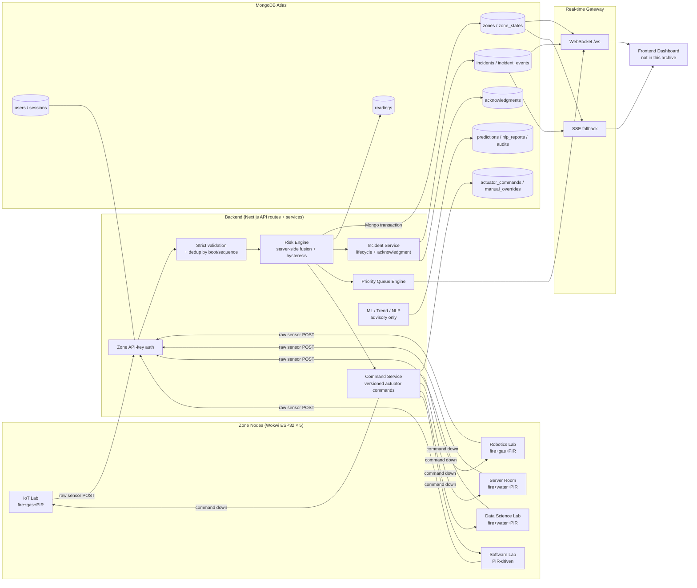
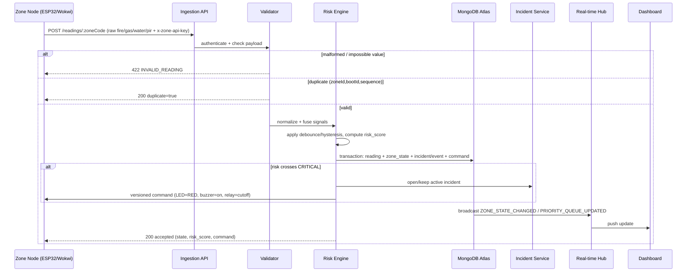
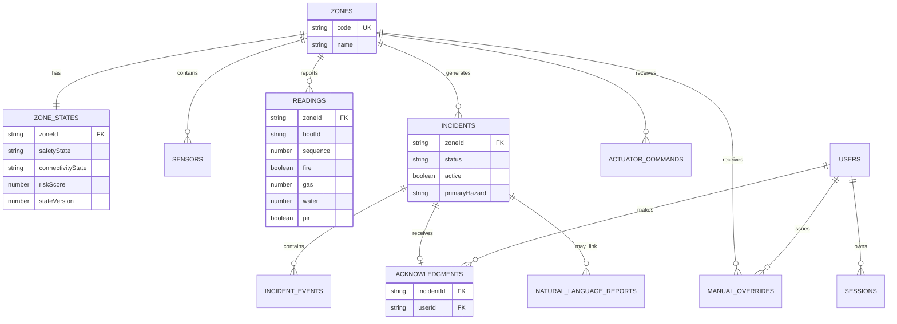
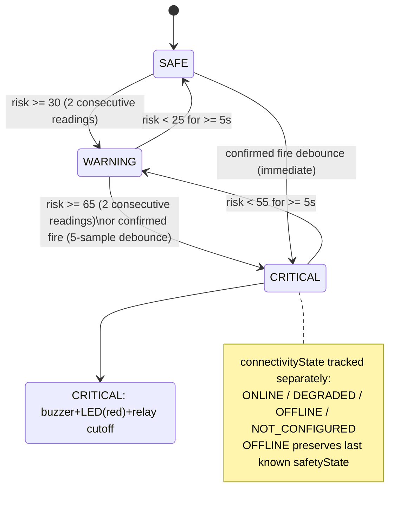
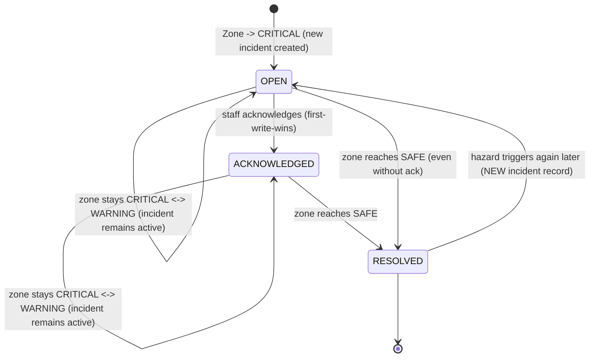
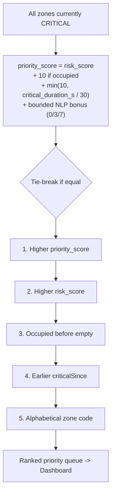
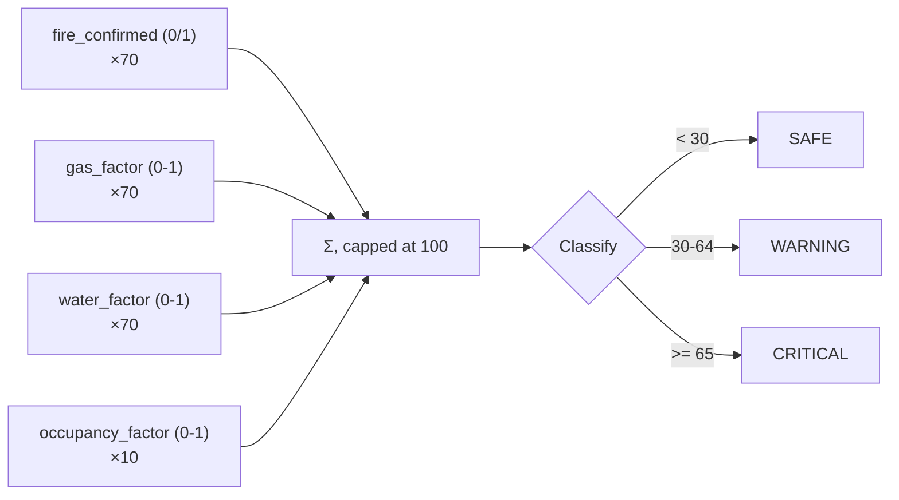
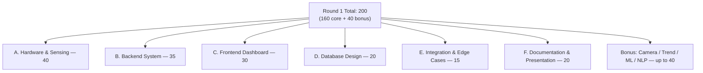

# RoboFusion 1.0 — SCS-RG — Diagrams (from PDF case + DevTork R1 repo)

Team: **DevTork** · Track: **B — Wokwi Simulation** · Backend: Node/TypeScript + MongoDB Atlas
Source: `RoboFusion_1_0_SCS-RG_Round1_Case.pdf` (problem statement) + `RoboFusion_SCS-RG_DevTork_R1-main.zip` (actual implementation)

---

## 1. System Architecture (as actually implemented)

---

## 2. Reading Ingestion Data Flow (sequence)

---

## 3. Database Entity-Relationship Diagram

---

## 4. Zone Safety-State Machine (per zone)

---

## 5. Incident Lifecycle

---

## 6. Priority Ranking Logic

---

## 7. Risk Fusion Formula (as implemented in repo, adapted from PDF Section 13)

---

## 8. PDF Round-1 Marks Map (for reference)

---

### Notes tying repo back to the PDF case
- Repo implements **all 5 labs** (PDF required minimum 3) as Wokwi simulation (Track B), matching PDF Section 04.
- Risk formula weights differ from the PDF's worked example (70/70/70/10 vs 40/25/20/15) — allowed per PDF Section 13 ("adapt or replace... as long as you explain them"); repo's `ARCHITECTURE.md` gives its own rationale.
- **Frontend dashboard is explicitly NOT included** in this archive (per its own README) — so Section C (30 marks) and parts of Section F/Video (Test Cases 12–16, 31) cannot be verified from this zip alone.
- Bonus 1 (camera) is only stubbed as a dev cross-check flag (`cameraOccupancy`), not real image-based detection — repo README says so itself.
- Backend, DB, and most edge-case/integration logic (Sections A, B, D, E) appear thoroughly implemented with tests (`tests/` folder covers concurrency, races, load, multi-zone priority).
