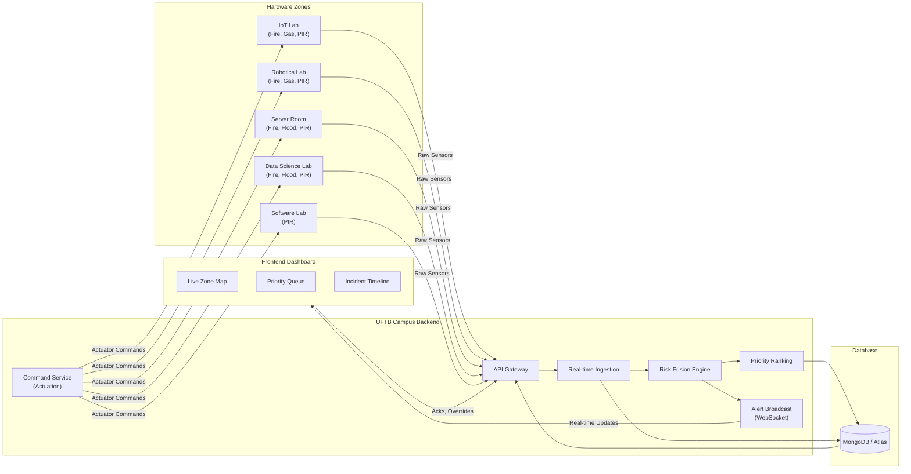

# Software Architecture Diagram

This diagram outlines the cloud architecture of the RoboFusion system, including hardware zones, the backend processing pipeline, the database, and the frontend dashboard.

