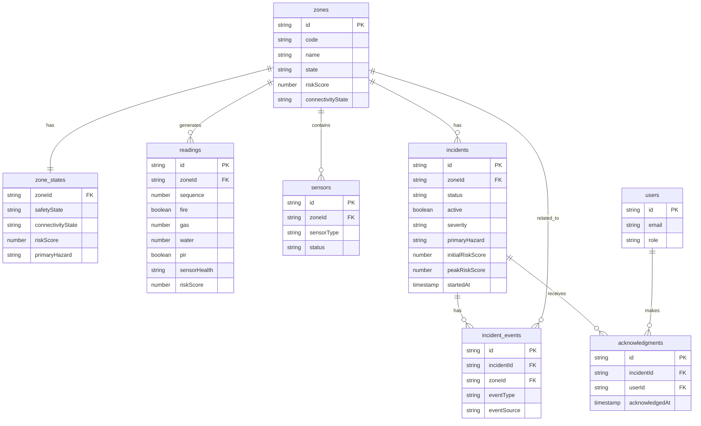

# Database Schema Diagram

This Entity Relationship Diagram illustrates the collections, their fields, and relationships within the RoboFusion MongoDB database.

```mermaid
erDiagram
    zones {
        string id PK
        string code
        string name
        string state
        number riskScore
        string connectivityState
    }

    zone_states {
        string zoneId FK
        string safetyState
        string connectivityState
        number riskScore
        string primaryHazard
    }

    readings {
        string id PK
        string zoneId FK
        number sequence
        boolean fire
        number gas
        number water
        boolean pir
        string sensorHealth
        number riskScore
    }

    sensors {
        string id PK
        string zoneId FK
        string sensorType
        string status
    }

    incidents {
        string id PK
        string zoneId FK
        string status
        boolean active
        string severity
        string primaryHazard
        number initialRiskScore
        number peakRiskScore
        timestamp startedAt
    }

    incident_events {
        string id PK
        string incidentId FK
        string zoneId FK
        string eventType
        string eventSource
    }

    acknowledgments {
        string id PK
        string incidentId FK
        string userId FK
        timestamp acknowledgedAt
    }

    users {
        string id PK
        string email
        string role
    }

    zones ||--|| zone_states : has
    zones ||--o{ readings : generates
    zones ||--o{ sensors : contains
    zones ||--o{ incidents : has
    incidents ||--o{ incident_events : has
    zones ||--o{ incident_events : related_to
    incidents ||--o{ acknowledgments : receives
    users ||--o{ acknowledgments : makes
```
